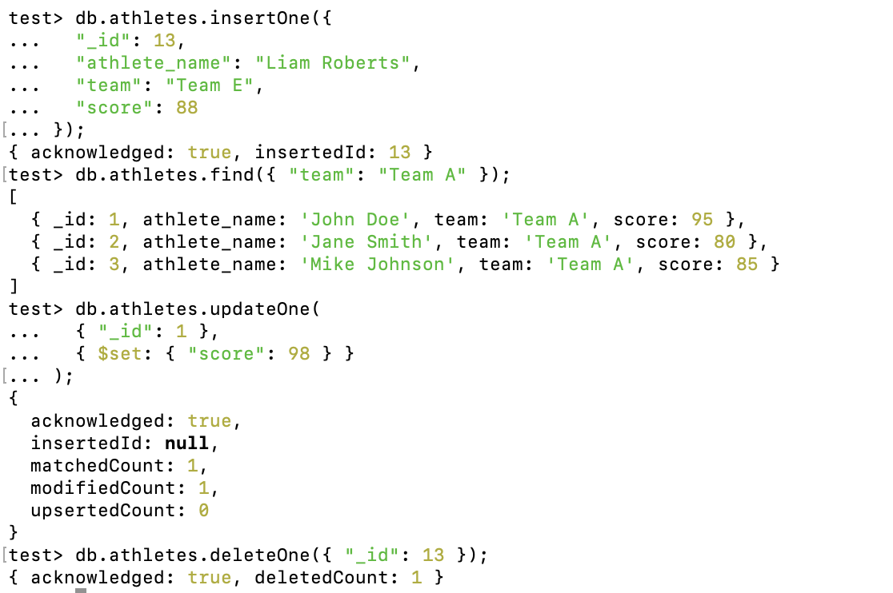

# MongoDB Assignment Report

## 1. Technical Problems During Installation and Resolution

### Problem Encountered: MongoDB Version Compatibility
The assignment specified using MongoDB version 4.4, but upon visiting MongoDB’s official website, I found that there was no direct documentation available for this version. Instead, the current available version was MongoDB 7.0.

However, my current version of macOS was not compatible with MongoDB 7.0, which prevented me from proceeding with the latest version. This led to a roadblock during installation.

### Resolution
After researching how to install an older version of MongoDB, I found a way to download MongoDB version 4.4. I manually installed this version by following instructions from the archived documentation. I also validated the installation successfully, as shown in the following screenshot.


## 2. CRUD Operations Examples Using Athletes Dataset

For this part of the assignment, I used a dataset of athletes where each document represents an athlete with fields like `_id`, `athlete_name`, `team`, and `score`.

### Create Operation (Insert)
This following code inserts a new athlete document into the `athletes` collection.

```javascript
db.athletes.insertOne({
  "_id": 13,
  "athlete_name": "Liam Roberts",
  "team": "Team E",
  "score": 88
});
```
The output is the following:
```bash
{ acknowledged: true, insertedId: 13 }
```

### Read Operation (Find)
This following query retrieves all athletes belonging to "Team A". The `find` method returns matching documents.

```javascript
db.athletes.find({ "team": "Team A" });
```
The output is the following:
```bash
[
  { _id: 1, athlete_name: 'John Doe', team: 'Team A', score: 95 },
  { _id: 2, athlete_name: 'Jane Smith', team: 'Team A', score: 80 },
  { _id: 3, athlete_name: 'Mike Johnson', team: 'Team A', score: 85 }
]
```

### Update Operation (Update)
This following code updates the score of the athlete with `_id` 1. The `$set` operator modifies the score to 98.
```javascript
db.athletes.updateOne(
  { "_id": 1 },
  { $set: { "score": 98 } }
);
```
The output is the following:
```bash
{
  acknowledged: true,
  insertedId: null,
  matchedCount: 1,
  modifiedCount: 1,
  upsertedCount: 0
}
```

### Delete Operation (Delete)
This following code deletes the athlete document with `_id` 13 from the collection.

```javascript
db.athletes.deleteOne({ "_id": 13 });
```
The output is the following:
```bash
{ acknowledged: true, deletedCount: 1 }
```

### Screenshot from MongoDB Shell:
The following screenshot shows the CRUD operations executed in MongoDB Shell:


## 3. Implementation of MapReduce Function

In this part of the assignment, I used a MapReduce function to calculate the top 3 teams in an athletic competition based on the average score of their athletes. The dataset contains individual athlete scores and their team affiliations. My goal was to group athletes by their respective teams, compute each team's average score, and then extract the top 3 teams with the highest averages.

Below is the code I used to insert the dataset of athletes into the `athletes` collection:

```javascript
db.athletes.insertMany([
  { "_id": 1, "athlete_name": "John Doe", "team": "Team A", "score": 95 },
  { "_id": 2, "athlete_name": "Jane Smith", "team": "Team A", "score": 80 },
  { "_id": 3, "athlete_name": "Mike Johnson", "team": "Team A", "score": 85 },
  { "_id": 4, "athlete_name": "Sarah Lee", "team": "Team B", "score": 70 },
  { "_id": 5, "athlete_name": "Chris Brown", "team": "Team B", "score": 75 },
  { "_id": 6, "athlete_name": "Emily Davis", "team": "Team B", "score": 85 },
  { "_id": 7, "athlete_name": "David Clark", "team": "Team C", "score": 90 },
  { "_id": 8, "athlete_name": "Emma Wilson", "team": "Team C", "score": 92 },
  { "_id": 9, "athlete_name": "James Taylor", "team": "Team C", "score": 88 },
  { "_id": 10, "athlete_name": "Daniel Garcia", "team": "Team D", "score": 78 },
  { "_id": 11, "athlete_name": "Olivia Martinez", "team": "Team D", "score": 82 },
  { "_id": 12, "athlete_name": "Sophia Anderson", "team": "Team D", "score": 81 }
]);
```

This dataset consists of 12 athletes across four teams (A, B, C, and D) with different individual scores, which I used to test the MapReduce function.

#### Map Function
In the map function, I emit each athlete’s team as the key and the athlete's score along with a count of 1 as the value. This way, I can group the scores by the team when the reduce function is executed.

```javascript
var mapFunction = function () {
  emit(this.team, { score: this.score, count: 1 });
};
```

#### Reduce Function
In the reduce function, I aggregate the athletes’ scores for each team. It goes through each value emitted by the map function (score and count) and sums them up. This step also counts how many athletes are associated with each team.

```javascript
var reduceFunction = function (team, values) {
  var reducedVal = { score: 0, count: 0 };

  values.forEach(function (value) {
    reducedVal.score += value.score;
    reducedVal.count += value.count;
  });

  return reducedVal;
};
```

#### Finalize Function
After reducing the data, I calculate the average score for each team in the finalize function. It takes the total score of the team and divides it by the number of athletes on that team.

```javascript
var finalizeFunction = function (team, reducedVal) {
  reducedVal.avgScore = reducedVal.score / reducedVal.count;
  return reducedVal;
};
```

#### Running MapReduce
I then ran the MapReduce operation using the following code:

```javascript
db.athletes.mapReduce(
  mapFunction,
  reduceFunction,
  {
    out: { inline: 1 }, // stores the results in memory
    finalize: finalizeFunction
  }
);
```

#### Why This MapReduce Operation is Useful
In this case, the dataset is composed of athlete scores, and the MapReduce function helps me group athletes by their teams and calculate the average score for each team. By leveraging the power of MapReduce, I can easily identify the best-performing teams based on their athletes' scores, without manually processing each record.

## 4. Pending Issues

- **Aggregation Framework Exploration**: Although the MapReduce operation works as intended, the Aggregation Framework is now the recommended approach in MongoDB. Thus, it may provide better performance and ease of use.

- **Old MongoDB Version**: Using MongoDB 4.4 due to macOS compatibility issues may limit my ability to explore newer features available in MongoDB 7.0. This could potentially affect future assignments that require modern functionality.
